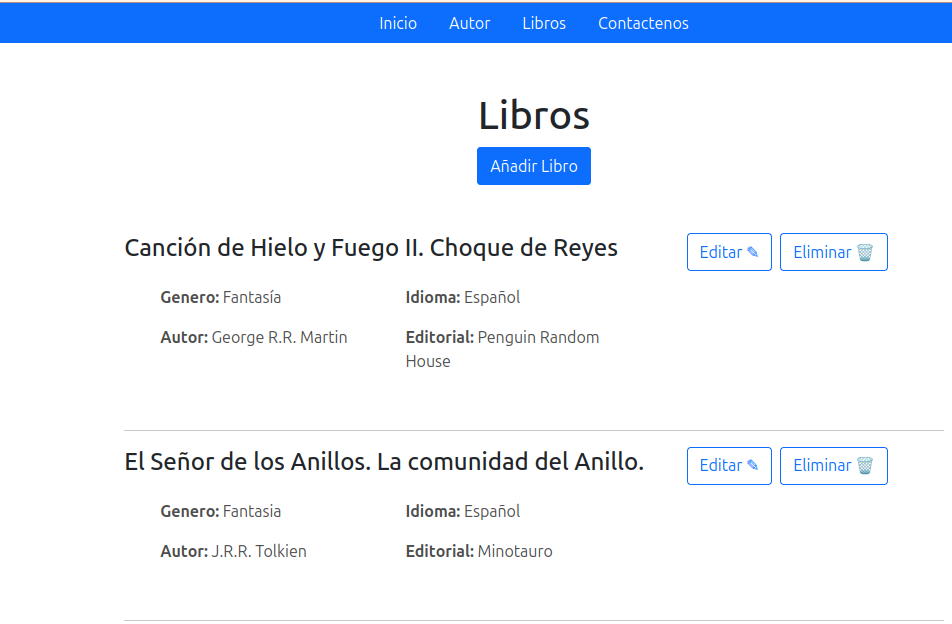

# Biblioteca
Aplicación de gestión de una biblioteca ficticia, mientras aprendo Django. Permite hacer CRUD a información acerca de los libros y su autores.

## Tecnologías
- Python
- Django 
- Bootstrap

## Funciones
- Página principal.
- Listar, crear, actualizar y eliminar autores.
- Listar, crear, actualizar y eliminar libros.
- Página con información de contacto.

## Captura
